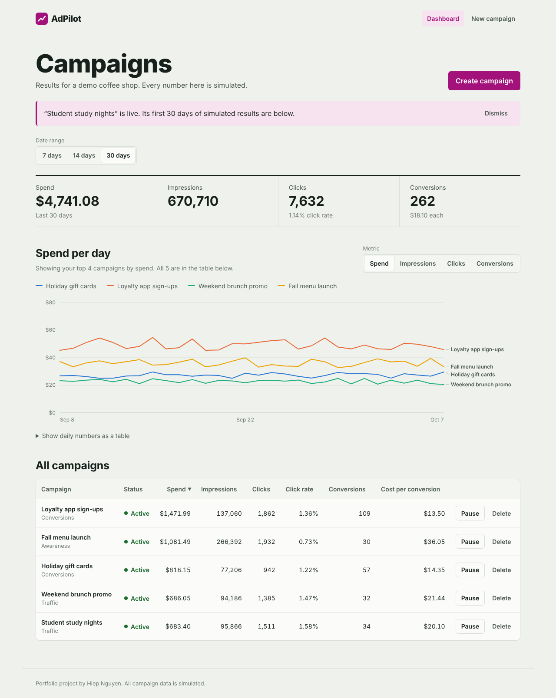
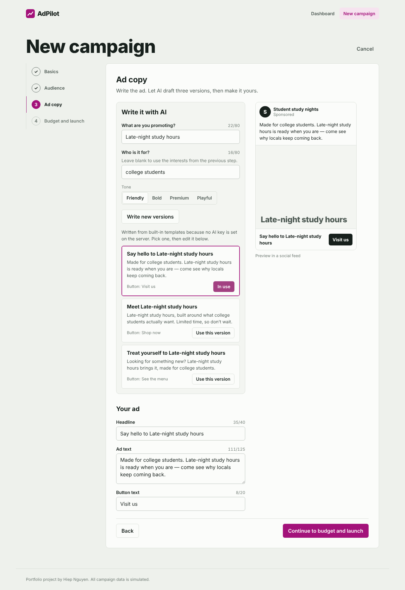
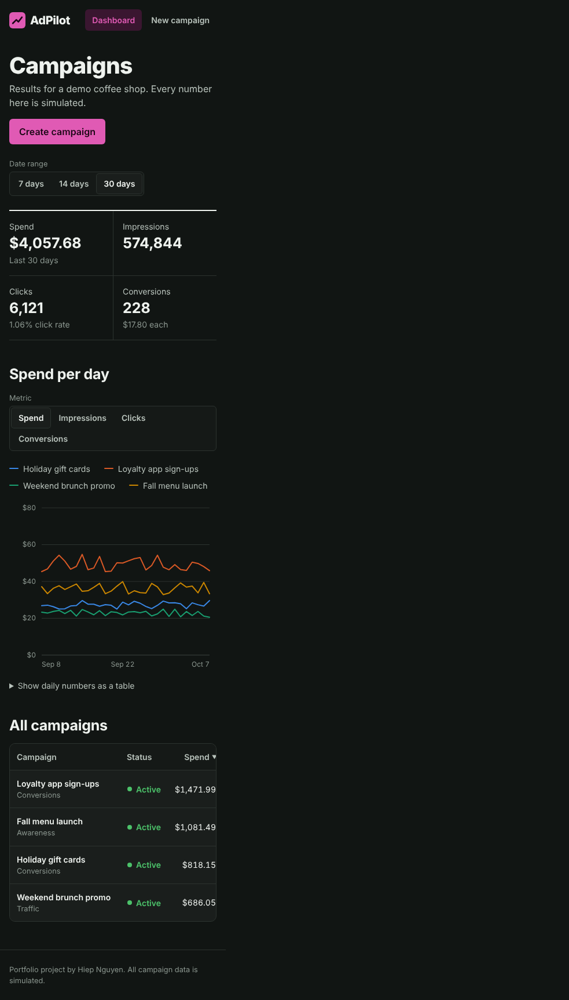
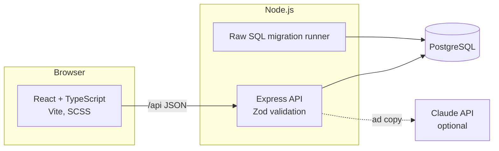

# AdPilot

An ad campaign builder for small businesses: a step-by-step creation wizard, AI-written ad copy, and a performance dashboard.

Built with React, TypeScript, SCSS, Node.js, Express, and PostgreSQL.

> All campaign data is **simulated**. There's no real ad network behind this app — new campaigns get a deterministic, realistic-looking 30-day history so the dashboard has something to show.



| Ad copy step with live preview | Mobile, dark mode |
|---|---|
|  |  |

## Features

- **Creation wizard** — four steps (basics, audience, ad copy, budget and launch) with per-step validation, field-level errors from the API mapped back to the right step, and a review screen.
- **AI ad copy** — generates three variants with Claude when `ANTHROPIC_API_KEY` is set. Without a key, or if the call fails or times out, built-in templates answer instead, so the wizard never dead-ends.
- **Live ad preview** — updates as you edit, with character limits enforced on both client and server.
- **Performance dashboard** — totals for 7/14/30 days, a hand-built SVG line chart with crosshair tooltip and keyboard support, and a sortable campaign table with pause, resume, and delete.

## Architecture



```
adpilot/
├── shared/types.ts        # Types used by both client and server
├── server/
│   └── src/
│       ├── app.ts         # Express app (no listen — tests import it)
│       ├── server.ts      # Boot: migrate, listen, graceful shutdown
│       ├── config/env.ts  # Every env var validated once at boot
│       ├── db/            # Pool, migration runner, .sql migrations, seed
│       ├── routes/        # HTTP layer + Zod schemas
│       ├── services/      # Campaign queries, AI copy, metric simulation
│       └── tests/         # Unit tests + API tests against real Postgres
└── client/
    └── src/
        ├── api/           # Typed fetch wrapper
        ├── components/    # Each component: .tsx + .scss + index.ts
        ├── pages/         # Dashboard, NewCampaign (lazy-loaded), NotFound
        └── styles/        # Tokens, mixins, theme (light + dark)
```

## Engineering decisions

- **Raw SQL migrations, no ORM.** Plain `.sql` files run in order by a small TypeScript runner. Each file runs in its own transaction, a Postgres advisory lock stops two instances racing, and applied files are tracked so re-running is safe. The server migrates on boot, so a fresh deploy never hits a missing table.
- **One source of truth for types.** `shared/types.ts` defines every request and response shape for both sides.
- **Validation on both sides.** The client validates each step for fast feedback; the server re-validates everything with Zod and returns field paths (`audience.ageMin`) that the wizard maps back to the right step and field.
- **SQL injection–safe metric switching.** The chart's metric name maps through a whitelist to a column name, so user input never reaches SQL text. Everything else is parameterized.
- **Time zones.** Reports cut over at local midnight (`APP_TIMEZONE`), not UTC — otherwise an evening visit in California would already show tomorrow.
- **Frontend performance.** The wizard is a separate lazy-loaded chunk; the chart is memoized and redraws at real pixel width via `ResizeObserver`; the daily data table renders only when opened; stale requests are aborted so a slow response can't overwrite a newer filter; refetches dim the old data instead of flashing a spinner.
- **Accessible chart.** Colors validated for color-blind separation, a legend plus direct line labels (identity never relies on color alone), keyboard navigation with arrow keys, and a table view of every value.
- **Styling rules.** SCSS with BEM class names, one stylesheet per component, no inline styles. Light and dark themes come from one set of CSS custom properties.

## How I built it

I use AI coding tools in a structured loop:

**Plan → Search → Prompt → Review → Test → Commit → Deploy → Monitor**

AI speeds up the writing; I review every line it produces for correctness, security, and performance, and refactor before testing. The test suite (unit + API tests against a real database) and the browser checks are what decide whether a change is done.

## Run it locally

Step-by-step setup, Windows notes, and troubleshooting are in **[GETTING_STARTED.md](GETTING_STARTED.md)**. The short version:

Requirements: Node.js 20+ and PostgreSQL 14+.

```bash
git clone https://github.com/kevngn6695/adpilot.git
cd adpilot
npm install

# Create a database, then configure the server
createdb adpilot
cp server/.env.example server/.env   # edit DATABASE_URL if needed

npm run db:seed    # creates tables + 4 demo campaigns
npm run dev        # API on :5050, web app on http://localhost:5173
```

Optional: add `ANTHROPIC_API_KEY` to `server/.env` for AI-written ad copy.

## Scripts

| Command | What it does |
|---|---|
| `npm run dev` | API and web app with hot reload |
| `npm run build` | Bundle the API and build the React app |
| `npm start` | Production server (serves API + built app) |
| `npm run typecheck` | TypeScript checks for both packages |
| `npm test` | Unit tests; add `TEST_DATABASE_URL` to also run API tests |
| `npm run db:migrate` | Apply pending migrations |
| `npm run db:seed` | Migrate, then add demo campaigns if the table is empty |
| `npm run db:reset` | Drop everything and reseed (disabled in production) |

API tests need a throwaway database — they drop and recreate its tables:

```bash
createdb adpilot_test
TEST_DATABASE_URL=postgres://localhost/adpilot_test npm test
```

## Deploy to Render

`render.yaml` defines the web service and a Postgres database.

1. Push this repo to GitHub.
2. In Render: **New → Blueprint**, pick the repo, and apply.
3. Optional: set `ANTHROPIC_API_KEY` on the service for AI copy.
4. To load demo data, open the service's **Shell** and run `node server/dist/cli.js seed`.

## API

| Method | Path | Description |
|---|---|---|
| GET | `/api/health` | Status and whether AI copy is enabled |
| GET | `/api/campaigns?days=7\|14\|30` | Campaigns with totals for the range |
| GET | `/api/campaigns/series?days=&metric=` | Daily values per campaign (`spend`, `impressions`, `clicks`, `conversions`) |
| GET | `/api/campaigns/:id` | One campaign |
| POST | `/api/campaigns` | Create a campaign (422 with field errors if invalid) |
| PATCH | `/api/campaigns/:id/status` | `{ "status": "active" \| "paused" }` |
| DELETE | `/api/campaigns/:id` | Delete a campaign and its metrics |
| POST | `/api/copy/generate` | Three ad copy variants |

All responses use `{ ok: true, data }` or `{ ok: false, error, issues? }`.

## License

MIT
